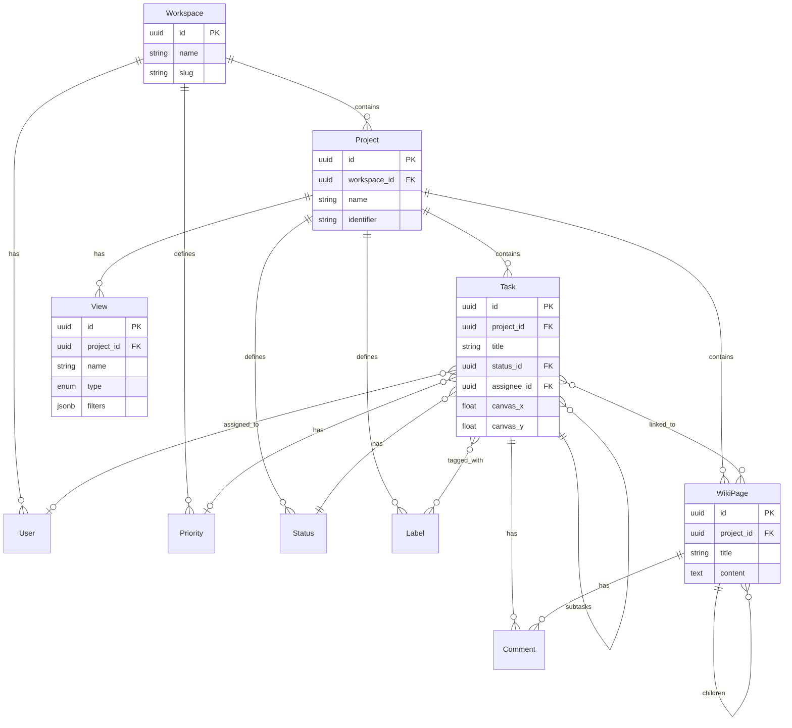

# Data Model

Data model for task-canvas – a multi-view project management prototype with list, canvas, wiki, and analytics views.

## ER Diagram



## Core Entities

### Workspace

Top-level container for projects and members.

| Field | Type | Description |
|-------|------|-------------|
| `id` | uuid | Primary key |
| `name` | string | Workspace name |
| `slug` | string | URL-friendly identifier |
| `description` | text | Optional description |
| `logo_url` | string | Workspace logo |
| `created_at` | timestamp | Creation date |
| `updated_at` | timestamp | Last modification |

### Project

A project groups related tasks, wiki pages, and views.

| Field | Type | Description |
|-------|------|-------------|
| `id` | uuid | Primary key |
| `workspace_id` | uuid | FK → Workspace |
| `name` | string | Project name |
| `slug` | string | URL-friendly identifier |
| `description` | text | Project description |
| `identifier` | string(5) | Short prefix for task IDs (e.g., "TC") |
| `color` | string | Project accent color |
| `icon` | string | Emoji or icon identifier |
| `is_archived` | boolean | Soft archive flag |
| `default_view` | enum | `list` \| `canvas` \| `board` |
| `created_at` | timestamp | |
| `updated_at` | timestamp | |

### Task

The central work item entity.

| Field | Type | Description |
|-------|------|-------------|
| `id` | uuid | Primary key |
| `project_id` | uuid | FK → Project |
| `parent_id` | uuid | FK → Task (for subtasks) |
| `sequence_id` | integer | Auto-increment per project |
| `title` | string | Task title |
| `description` | text | Rich text / markdown content |
| `status_id` | uuid | FK → Status |
| `priority_id` | uuid | FK → Priority |
| `assignee_id` | uuid | FK → User |
| `start_date` | date | Planned start |
| `due_date` | date | Deadline |
| `completed_at` | timestamp | When marked done |
| `estimate_hours` | decimal | Time estimate |
| `sort_order` | integer | Position in list view |
| `canvas_x` | float | X coordinate for canvas view |
| `canvas_y` | float | Y coordinate for canvas view |
| `canvas_z_index` | integer | Layer order on canvas |
| `is_archived` | boolean | Soft delete |
| `created_at` | timestamp | |
| `updated_at` | timestamp | |

### Status

Workflow states for tasks.

| Field | Type | Description |
|-------|------|-------------|
| `id` | uuid | Primary key |
| `project_id` | uuid | FK → Project |
| `name` | string | Status name |
| `color` | string | Hex color |
| `category` | enum | `backlog` \| `todo` \| `in_progress` \| `done` \| `cancelled` |
| `sort_order` | integer | Display order |
| `is_default` | boolean | Default for new tasks |

### Priority

Task priority levels.

| Field | Type | Description |
|-------|------|-------------|
| `id` | uuid | Primary key |
| `workspace_id` | uuid | FK → Workspace (shared across projects) |
| `name` | string | e.g., "Urgent", "High", "Medium", "Low" |
| `color` | string | Hex color |
| `icon` | string | Icon identifier |
| `sort_order` | integer | Display order (higher = more urgent) |

### Label

Tags for categorizing tasks.

| Field | Type | Description |
|-------|------|-------------|
| `id` | uuid | Primary key |
| `project_id` | uuid | FK → Project |
| `name` | string | Label name |
| `color` | string | Hex color |
| `description` | text | Optional description |

### TaskLabel

Many-to-many relationship between tasks and labels.

| Field | Type | Description |
|-------|------|-------------|
| `task_id` | uuid | FK → Task |
| `label_id` | uuid | FK → Label |

### User

Users who can be assigned to tasks.

| Field | Type | Description |
|-------|------|-------------|
| `id` | uuid | Primary key |
| `workspace_id` | uuid | FK → Workspace |
| `email` | string | Unique email |
| `name` | string | Display name |
| `avatar_url` | string | Profile image |
| `role` | enum | `owner` \| `admin` \| `member` \| `guest` |
| `created_at` | timestamp | |

## Wiki System

### WikiPage

Documentation pages linked to a project.

| Field | Type | Description |
|-------|------|-------------|
| `id` | uuid | Primary key |
| `project_id` | uuid | FK → Project |
| `parent_id` | uuid | FK → WikiPage (for hierarchy) |
| `title` | string | Page title |
| `slug` | string | URL-friendly identifier |
| `content` | text | Markdown/rich text content |
| `icon` | string | Emoji or icon |
| `is_locked` | boolean | Prevent edits |
| `sort_order` | integer | Position in sidebar |
| `created_by` | uuid | FK → User |
| `updated_by` | uuid | FK → User |
| `created_at` | timestamp | |
| `updated_at` | timestamp | |

### WikiPageTaskLink

Links between wiki pages and tasks (bidirectional references).

| Field | Type | Description |
|-------|------|-------------|
| `id` | uuid | Primary key |
| `page_id` | uuid | FK → WikiPage |
| `task_id` | uuid | FK → Task |
| `created_by` | uuid | FK → User |
| `created_at` | timestamp | |

## Views & Filters

### View

Saved views with custom filters and display settings.

| Field | Type | Description |
|-------|------|-------------|
| `id` | uuid | Primary key |
| `project_id` | uuid | FK → Project |
| `name` | string | View name |
| `type` | enum | `list` \| `board` \| `canvas` \| `calendar` \| `timeline` |
| `filters` | jsonb | Filter configuration |
| `sort_by` | jsonb | Sort configuration |
| `group_by` | string | Grouping field |
| `display_fields` | jsonb | Visible columns/fields |
| `is_default` | boolean | Default view for project |
| `is_shared` | boolean | Visible to all users |
| `created_by` | uuid | FK → User |
| `created_at` | timestamp | |
| `updated_at` | timestamp | |

**Example `filters` JSON:**
```json
{
  "status_id": { "in": ["uuid1", "uuid2"] },
  "priority_id": { "eq": "uuid3" },
  "assignee_id": { "is_not_null": true },
  "due_date": { "lte": "2025-01-31" },
  "labels": { "contains": ["uuid4"] }
}
```

## Comments

### Comment

Discussion on tasks or wiki pages.

| Field | Type | Description |
|-------|------|-------------|
| `id` | uuid | Primary key |
| `task_id` | uuid | FK → Task (nullable) |
| `page_id` | uuid | FK → WikiPage (nullable) |
| `parent_id` | uuid | FK → Comment (for threads) |
| `content` | text | Comment body |
| `created_by` | uuid | FK → User |
| `created_at` | timestamp | |
| `updated_at` | timestamp | |

## Attachments (Future)

Attachments can be added later when file upload functionality is needed.

## Analytics (Future)

Analytics aggregations can be computed on-the-fly from the task data for the prototype. Pre-computed stats tables like `DailyProjectStats` can be added when performance requires it.

## Entity Relationships

```
Workspace 1──N Project
Workspace 1──N User
Workspace 1──N Priority

Project 1──N Task
Project 1──N Status
Project 1──N Label
Project 1──N WikiPage
Project 1──N View

Task N──1 Status
Task N──1 Priority
Task N──1 User (assignee)
Task 1──N Task (subtasks)
Task N──M Label (via TaskLabel)
Task 1──N Comment
Task N──M WikiPage (via WikiPageTaskLink)

WikiPage 1──N WikiPage (children)
WikiPage 1──N Comment

View N──1 User (created_by)
Comment N──1 User (created_by)
```

## Indexes (PostgreSQL)

For when migrating to PostgreSQL:

```sql
-- Task lookups
CREATE INDEX idx_tasks_project_id ON tasks(project_id);
CREATE INDEX idx_tasks_status_id ON tasks(status_id);
CREATE INDEX idx_tasks_assignee_id ON tasks(assignee_id);
CREATE INDEX idx_tasks_due_date ON tasks(due_date);
CREATE INDEX idx_tasks_project_sequence ON tasks(project_id, sequence_id);

-- Wiki
CREATE INDEX idx_wiki_pages_project ON wiki_pages(project_id);
CREATE INDEX idx_wiki_pages_parent ON wiki_pages(parent_id);

-- Full-text search
CREATE INDEX idx_tasks_search ON tasks USING gin(to_tsvector('english', title || ' ' || COALESCE(description, '')));
CREATE INDEX idx_wiki_search ON wiki_pages USING gin(to_tsvector('english', title || ' ' || COALESCE(content, '')));
```

## Notes

- **JSON-first**: Start with static JSON files for rapid frontend prototyping, migrate to PostgreSQL later.
- **Canvas coordinates**: Stored directly on Task (`canvas_x`, `canvas_y`, `canvas_z_index`) for simplicity.
- **Soft Deletes**: Use `is_archived` flags rather than hard deletes to preserve history.
- **IDs**: Use UUIDs for easier JSON generation and future database migration.

## JSON File Structure (for prototype)

```
/data
├── workspace.json
├── users.json
├── projects.json
├── statuses.json
├── priorities.json
├── labels.json
├── tasks.json
├── wiki-pages.json
├── views.json
└── comments.json
```
