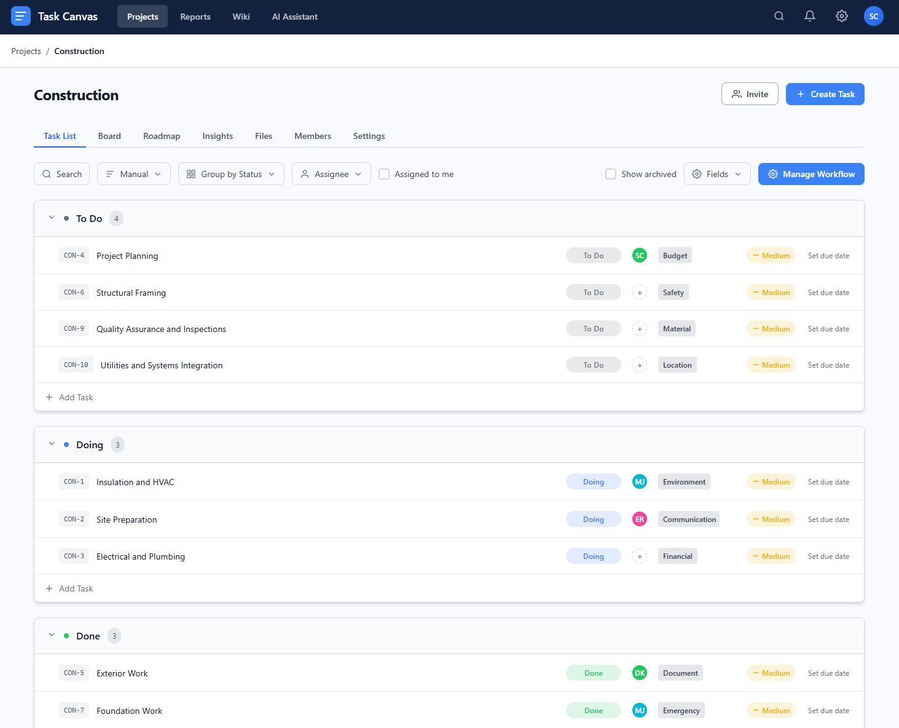
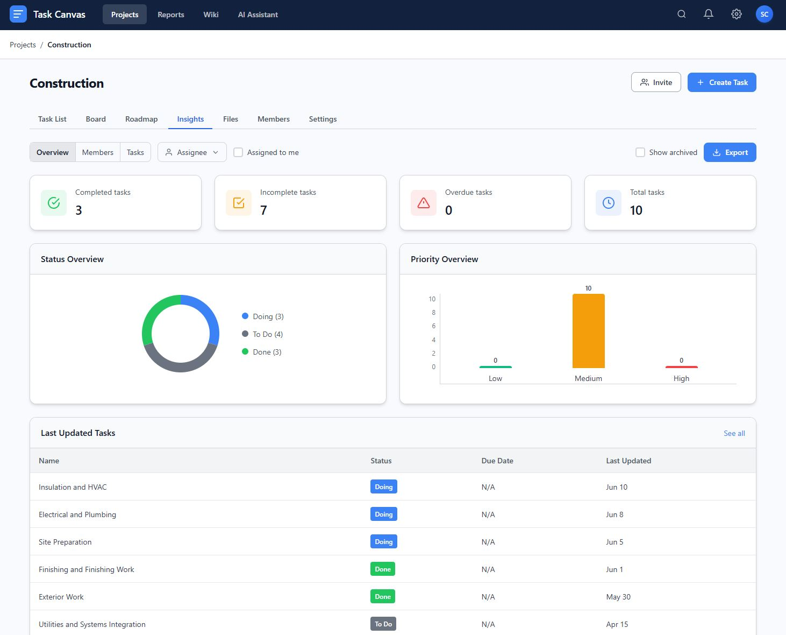

# Task Canvas

A modern, feature-rich project management application built with vanilla JavaScript. No frameworks, no build steps - just open and run.

<p align="center">
  
  
</p>

## Features

### Multiple Views

- **Task List** - Sortable, groupable task table with inline editing
- **Board** - Kanban-style board with drag-and-drop columns
- **Roadmap** - Gantt chart timeline with week/month/quarter/year scales
- **Insights** - Analytics dashboard with KPIs, status breakdown, and priority charts
- **Files** - File attachment management with upload and download
- **Members** - Team member management with role assignments
- **Settings** - Project configuration and workflow customization

### Filtering & Organization

- Filter tasks by assignee (multi-select)
- "Assigned to me" quick filter
- Show/hide archived tasks
- Search across tasks
- Sort by title, priority, due date, or custom order
- Group by status, priority, or assignee

### Workflow Management

- Custom status workflows per project
- Configurable task fields visibility
- Priority levels with visual indicators
- Due date tracking with overdue highlighting

### Modern UI

- Clean, responsive design
- Consistent toolbar patterns across all views
- Dropdown menus and modals
- Real-time updates without page refresh

## Quick Start

1. Clone or download this repository
2. Open `index.html` in a modern browser
3. Start managing your projects!

No build step, no dependencies, no server required.

## Project Structure

```
task-canvas/
├── index.html          # Main HTML file
├── css/
│   └── styles.css      # All styles (CSS custom properties, components)
├── js/
│   ├── app.js          # Main application logic
│   └── state.js        # State management and mock data
└── README.md
```

## Tech Stack

- **HTML5** - Semantic markup
- **CSS3** - Custom properties, flexbox, grid, animations
- **Vanilla JavaScript** - ES6+, no frameworks
- **SVG Icons** - Inline SVG for crisp icons at any size

## Browser Support

Works in all modern browsers (Chrome, Firefox, Safari, Edge).

## License

MIT
